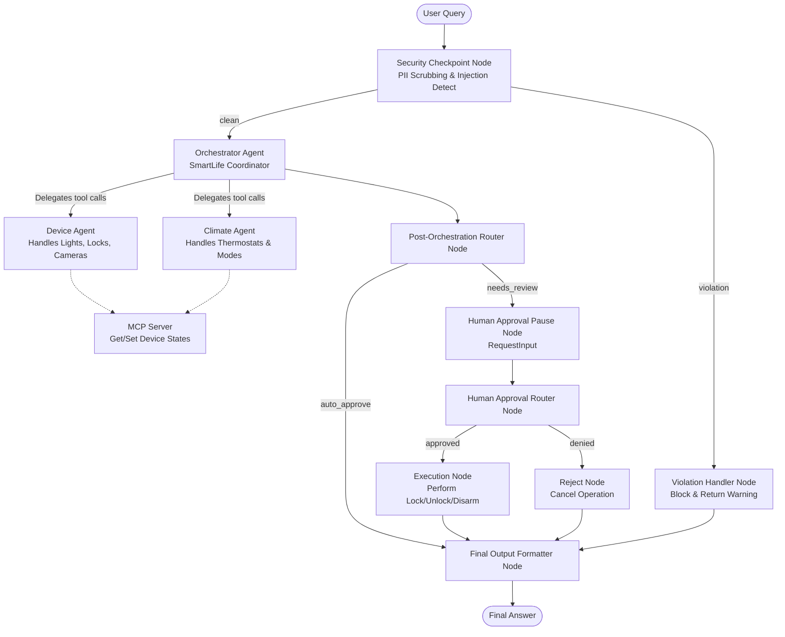
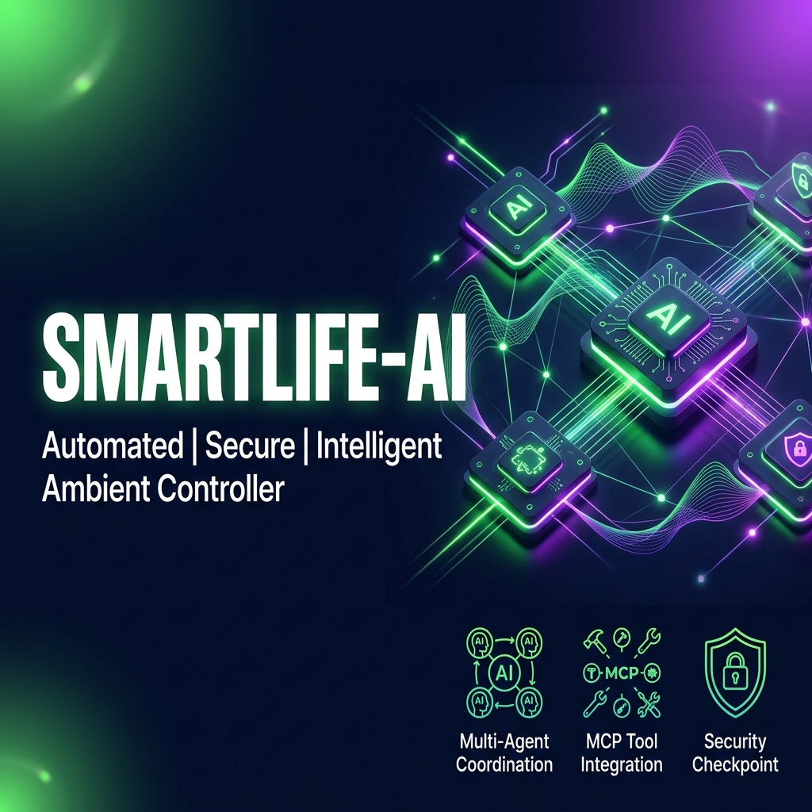
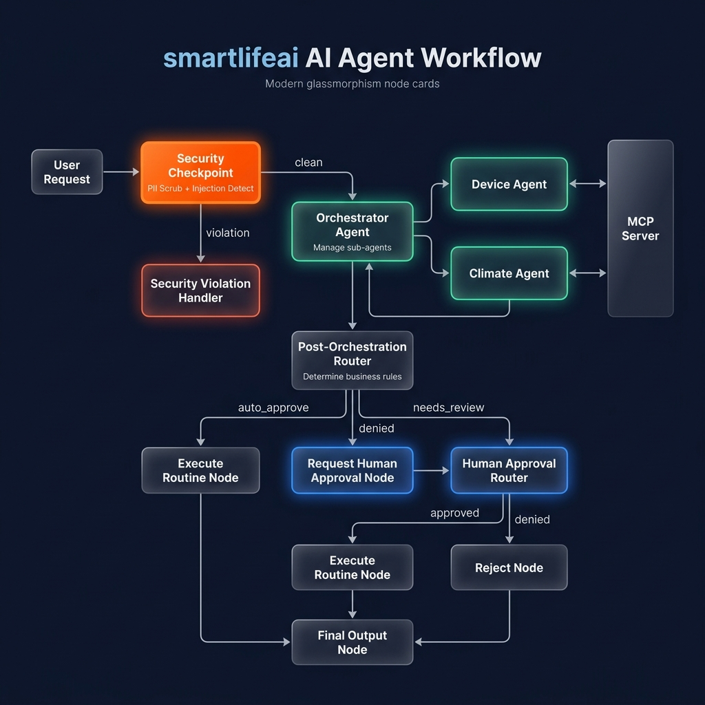

# 🏡 SmartLife AI Ambient Controller

An intelligent, multi-agent smart home ambient assistant powered by the Google ADK and Gemini API. It manages smart devices and climate controls while enforcing strict security filters (PII redaction, prompt injection protection) and human-in-the-loop (HITL) approval for critical operations (e.g., unlocking doors).

---

## 📋 Prerequisites

Before running the project, ensure you have installed:
- **Python 3.11+**
- **uv** (Fast Python package manager)
- **Gemini API Key** from [Google AI Studio](https://aistudio.google.com/apikey)

---

## ⚡ Quick Start

1. **Clone the repository:**
   ```bash
   git clone <repo-url>
   cd smartlife-ai
   ```

2. **Set up the environment variables:**
   Copy the example environment file and add your `GOOGLE_API_KEY`:
   ```bash
   cp .env.example .env
   ```
   Ensure your `.env` contains:
   ```env
   GOOGLE_API_KEY=your_gemini_api_key_here
   GOOGLE_GENAI_USE_VERTEXAI=False
   GEMINI_MODEL=gemini-2.5-flash
   ```

3. **Install dependencies:**
   ```bash
   make install
   ```

4. **Launch the Playground:**
   Start the interactive local testing web interface:
   - **macOS / Linux:**
     ```bash
     make playground
     ```
   - **Windows (PowerShell):**
     ```powershell
     uv run adk web app --host 127.0.0.1 --port 18081 --reload_agents
     ```
   Open your browser to [http://localhost:18081](http://localhost:18081) to interact with the agent.

---

## 🏗️ Solution Architecture

The application uses an event-driven multi-agent workflow graph. All user queries go through a security checkpoint before reaching the orchestrator.



---

## ⚙️ How to Run

- **Interactive Playground (Web UI):**
  - macOS/Linux: `make playground`
  - Windows: `uv run adk web app --host 127.0.0.1 --port 18081 --reload_agents`
- **FastAPI Backend (Local API Server):**
  - Run: `make run` (Starts API server on http://localhost:8090)
- **Run Unit Tests:**
  - Run: `make test` or `uv run pytest tests/`

---

## 🧪 Sample Test Cases

Try sending these queries in the Playground UI:

### Case 1: Standard Query (Auto-Approved)
- **Input:** `What is the status of the living room light?`
- **Expected Route:** `START` ➔ `security_checkpoint` (clean) ➔ `orchestrator_agent` ➔ `device_agent` (calls MCP `get_device_status`) ➔ `post_orchestration_router` (auto_approve) ➔ `final_output_node`.
- **Check in UI:** You should see that the living room light is currently `off` with `brightness: 70%`. Check the terminal audit log to see `severity: INFO`.

### Case 2: PII Redaction & Climate Control
- **Input:** `My email is test@example.com. Please set the thermostat temperature to 74F.`
- **Expected Route:** `START` ➔ `security_checkpoint` (redacts email to `[REDACTED_EMAIL]`) ➔ `orchestrator_agent` ➔ `climate_agent` (calls MCP `set_device_state` with value `74F`) ➔ `post_orchestration_router` (auto_approve) ➔ `final_output_node`.
- **Check in UI:** The response should state that the thermostat temperature has been successfully set to `74F`. The terminal logs will print an audit log with `has_pii: true` and `severity: WARNING` due to PII.

### Case 3: Critical Action with Human-in-the-Loop (HITL)
- **Input:** `Please unlock the front door lock.`
- **Expected Route:** `START` ➔ `security_checkpoint` (clean) ➔ `orchestrator_agent` (intercepts critical action, returns `CRITICAL_SECURITY_ACTION`) ➔ `post_orchestration_router` (needs_review) ➔ `request_human_approval_node` (pauses and asks for input) ➔ User responds `yes` ➔ `human_approval_router` (approved) ➔ `execute_routine_node` (marks status as executed) ➔ `final_output_node`.
- **Check in UI:** The playground will pause and show an input field asking: `✋ HUMAN APPROVAL REQUIRED: Do you approve executing: 'unlock the front door lock'?`. Enter `yes`. The final text will confirm: `✅ Approved: The critical action 'unlock the front door lock' has been successfully executed.`

---

## 🛠️ Troubleshooting

1. **`404 Model Not Found` Error on Query:**
   - **Cause:** Using retired model `gemini-1.5-*`.
   - **Solution:** Edit your local `.env` and set `GEMINI_MODEL=gemini-2.5-flash`.
2. **`Address already in use` or connection refused on port 18081:**
   - **Cause:** A previous playground process is still running.
   - **Solution (Windows PowerShell):**
     ```powershell
     Get-Process -Id (Get-NetTCPConnection -LocalPort 18081, 8090 -ErrorAction SilentlyContinue).OwningProcess | Stop-Process -Force
     ```
   - **Solution (macOS / Linux):**
     ```bash
     lsof -ti:18081,8090 | xargs kill -9
     ```
3. **`adk web` crashes with "Got unexpected extra arguments" (Windows):**
   - **Cause:** PowerShell wildcards expanding standard flags.
   - **Solution:** Avoid `make playground` on Windows. Always run:
     ```powershell
     uv run adk web app --host 127.0.0.1 --port 18081 --reload_agents
     ```

---

## 🖼️ Assets

### Project Banner


### Workflow Architecture Diagram


---

## 📝 Demo Script

A detailed presenter guide is available at [DEMO_SCRIPT.txt](file:///c:/Users/Rethika.S/OneDrive/Desktop/adk-workspace1/smartlife-ai/DEMO_SCRIPT.txt).

---

## Push to GitHub

1. Create a new repo at https://github.com/new
   - Name: `smartlife-ai`
   - Visibility: Public or Private
   - Do NOT initialize with README (you already have one)

2. In your terminal, navigate into your project folder:
   ```bash
   cd smartlife-ai
   git init
   git add .
   git commit -m "Initial commit: smartlife-ai ADK agent"
   git branch -M main
   git remote add origin https://github.com/<your-username>/smartlife-ai.git
   git push -u origin main
   ```

3. Verify `.gitignore` includes:
   ```gitignore
   .env          ← your API key — must NEVER be pushed
   .venv/
   __pycache__/
   *.pyc
   .adk/
   ```

⚠️ **NEVER** push `.env` to GitHub. Your API key will be exposed publicly.
