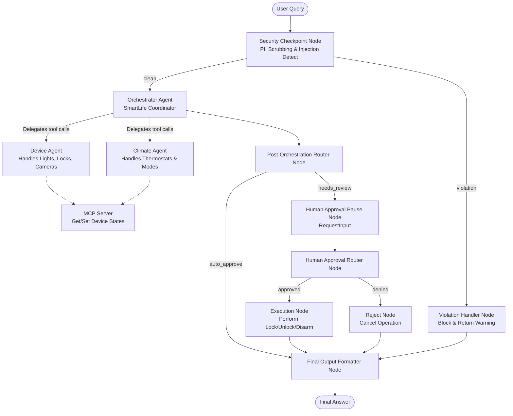

# 📄 Submission Write-Up: SmartLife AI Ambient Controller

## 1. Problem Statement
In a modern smart home, users want to interact with their environment seamlessly using natural language. However, giving an LLM direct control over smart devices presents several significant real-world challenges:
- **Security Risks:** High-risk actions like unlocking doors or disarming security systems could be triggered accidentally, maliciously via prompt injection, or by unauthorized users.
- **Privacy Concerns:** Personal Identifiable Information (PII) like phone numbers and email addresses shouldn't be forwarded to external LLM APIs if not necessary.
- **Complex Domain Coordination:** Managing different domains (general devices vs. climate systems) requires separate specialist agents to avoid prompt bloat and keep decision-making accurate.

The **SmartLife AI Ambient Controller** solves this by establishing a secure, multi-agent coordination system that intercepts unsafe commands, sanitizes sensitive data, handles routing gracefully, and prompts for explicit human approval before executing any critical operation.

---

## 2. Solution Architecture
The application is structured as a directed workflow graph using ADK 2.0.

---

## 3. ADK & Agent Concepts Utilized

The system leverages several core features of the Google Agent Development Kit (ADK) to implement the architecture:

- **ADK Workflow Graph:** The entire execution flow is managed as an event-driven workflow graph defined in [app/agent.py](file:///c:/Users/Rethika.S/OneDrive/Desktop/adk-workspace1/smartlife-ai/app/agent.py#L233-L255) using custom nodes and edges rather than a rigid linear chain.
- **Specialized LlmAgents:** The project splits responsibilities between three agents:
  - `orchestrator_agent` (handles high-level coordination and security instructions)
  - `device_agent` (manages general smart devices like locks, cameras, and lights)
  - `climate_agent` (handles heating and cooling/thermostats)
- **AgentTools:** The `orchestrator_agent` delegates tasks to specialized sub-agents using `AgentTool(agent=device_agent)` and `AgentTool(agent=climate_agent)` in [app/agent.py](file:///c:/Users/Rethika.S/OneDrive/Desktop/adk-workspace1/smartlife-ai/app/agent.py#L67).
- **Model Context Protocol (MCP) Server:** A local stdio-based MCP server running from [app/mcp_server.py](file:///c:/Users/Rethika.S/OneDrive/Desktop/adk-workspace1/smartlife-ai/app/mcp_server.py) exposes tools to fetch status and modify states of smart home devices. The sub-agents are equipped with this toolset using `McpToolset` in [app/agent.py](file:///c:/Users/Rethika.S/OneDrive/Desktop/adk-workspace1/smartlife-ai/app/agent.py#L32-L48).
- **Workflow State (`ctx.state`):** State is shared between graph nodes (e.g. storing scrubbed queries, pending action details, and approval flags) using `ctx.state` as seen in [app/agent.py](file:///c:/Users/Rethika.S/OneDrive/Desktop/adk-workspace1/smartlife-ai/app/agent.py#L131).
- **Human-In-The-Loop (`RequestInput`):** For critical physical actions, the workflow leverages `yield RequestInput(...)` in [app/agent.py](file:///c:/Users/Rethika.S/OneDrive/Desktop/adk-workspace1/smartlife-ai/app/agent.py#L173-L178) to temporarily pause the graph and wait for explicit human approval via the terminal or playground UI.
- **Agents CLI:** Scaffolding, dependency pinning, and playground running were all managed through `agents-cli` as configured in [agents-cli-manifest.yaml](file:///c:/Users/Rethika.S/OneDrive/Desktop/adk-workspace1/smartlife-ai/agents-cli-manifest.yaml) and [pyproject.toml](file:///c:/Users/Rethika.S/OneDrive/Desktop/adk-workspace1/smartlife-ai/pyproject.toml).

---

## 4. Security Design
Safety is baked into the system at multiple levels:
1. **PII Scrubbing:** Regular expressions in `security_checkpoint` detect email addresses and US phone numbers, replacing them with generic tags (e.g., `[REDACTED_EMAIL]`) before sending queries to LLM sub-agents.
2. **Prompt Injection Protection:** The `security_checkpoint` inspects queries for jailbreak phrases like `ignore previous instructions` or `dan mode`. If found, it routes immediately to `security_violation_handler`, short-circuiting the flow and blocking the request entirely.
3. **Structured Audit Logging:** Every evaluation at the checkpoint produces a JSON-structured audit log logged at specific levels (`INFO`, `WARNING`, or `CRITICAL`) depending on the presence of PII or injection risks.
4. **Command Validation Rule:** Queries exceeding 300 characters are logged as warnings and flagged to prevent resource exhaustion attacks.
5. **Critical Operation Interception:** The orchestrator agent is instructed never to call tools directly for high-risk operations (e.g., unlocking, disarming). Instead, it outputs a `CRITICAL_SECURITY_ACTION` keyword, which is captured by the graph router to force a human review pause.

---

## 5. MCP Server Design
The Model Context Protocol (MCP) server runs as a local stdio subprocess from [app/mcp_server.py](file:///c:/Users/Rethika.S/OneDrive/Desktop/adk-workspace1/smartlife-ai/app/mcp_server.py). It manages a simulated in-memory smart home database and exposes three tools:
1. `list_connected_devices()`: Returns a JSON-formatted list of all devices (locks, lights, cameras, thermostats).
2. `get_device_status(device_id)`: Fetches detailed state variables for a particular device.
3. `set_device_state(device_id, state, value)`: Changes a device's status and updates optional parameters like temperature or brightness, validating compatibility (e.g., checking that a light only accepts `on`/`off`).

---

## 6. Human-In-The-Loop (HITL) Flow
To balance convenience and safety, standard queries (like checking light status or adjusting temperature) are **auto-approved** and run instantly.

However, physical and security-sensitive operations (specifically: **unlocking a door**, **disarming a security camera**, or **turning off an alarm**) require a human confirmation:
- The Orchestrator returns a special instruction rather than running the tool.
- The `post_orchestration_router` intercepts this response and routes the workflow to `request_human_approval_node`.
- The node yields a `RequestInput` which pauses the workflow and prompts the user.
- Execution only proceeds to `execute_routine_node` if the user replies `yes` (or similar approval). Otherwise, it routes to `reject_node` and aborts.

---

## 7. Demo Walkthrough
1. **Case 1: Reading Device Status**
   - *Query:* "What is the status of the living room light?"
   - *Result:* Routes directly. The orchestrator delegates to the Device Agent, which calls the `list_connected_devices` and `get_device_status` tools. The user is immediately answered that the light is off at 70% brightness.
2. **Case 2: PII Redaction & Climate Command**
   - *Query:* "My email is user@test.com. Please set the climate control to 72F."
   - *Result:* The email is scrubbed at the input. The climate agent updates the temperature. The audit log flags that PII was redacted, but the temperature is safely set.
3. **Case 3: Intercepting Critical Operations**
   - *Query:* "Unlock the front door."
   - *Result:* The orchestrator returns a critical action message. The graph pauses and prompts: `✋ HUMAN APPROVAL REQUIRED...`. If the user inputs `yes`, the lock state is updated to `unlocked` and confirmed.

---

## 8. Impact / Value Statement
The SmartLife AI Ambient Controller demonstrates how to build user-friendly smart home voice/text assistants without sacrificing physical security or data privacy. By separating concerns into sub-agents, running tools through standard protocols (MCP), and wrapping the LLM with a hard-coded security and human-approval workflow graph, we create an assistant that is both highly intelligent and safe to trust with physical access controls.
